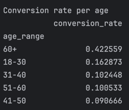
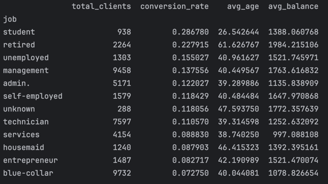
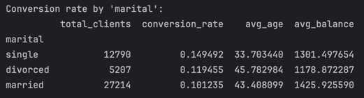
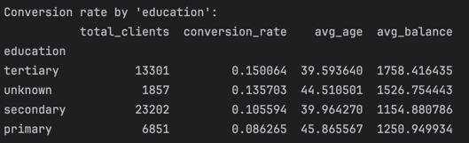
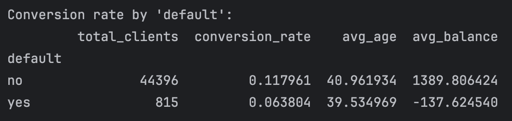
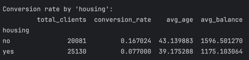
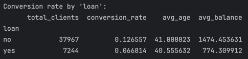
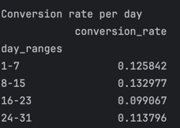
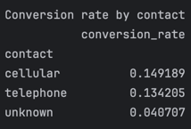
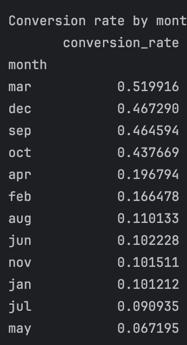

## Practica 2

**Instrucciones:** Run descriptive statistics to data, identify the entities and relations and draw its diagram. Also group data by entities and obtain statistics from grouped data.

Nota: Respecto a la practica pasada se modifico un poco la forma en la que se trabajara
con los datasets, pues solo se habia incluido un dataset de 4521 filas, el cual corresponde
al dataset de testeo, se agregó la parte de entrenamiento. Estos se necuentran en
```/datasets```

### Entidades

1. Clients
    - Age (int)
    - Job (string - categorical)
    - Marital (string - categorical)
    - Education (stirng - categorical)
    - Default (boolean)
    - Balance (int)
    - Housing (boolean)
    - Loan (binary)
2. Contacts 
   - Contact (string - categorical)
   - Day (int)
   - Month (int)
   - Duration (seconds) (int)
   - Campaign (int)
   - Pdays (int)
   - Previous (int)
   - Poutcome (string - categorical)

### Clientes
#### Tasa de conversion por edad


#### Tasa de conversion por trabajo


#### Tasa de conversion por estado civil


#### Tasa conversion por nivel educativo


#### Tasa de conversion por incumplimientos de pago (default)


#### Tasa de conversion por posesion de prestamos hiptecarios


#### Tasa de conversion por posesion de creditos


### Contact
#### Tasa de conversion por semana

#### Tasa de conversion por tipo de contacto

#### Tasas de conversion por mes
